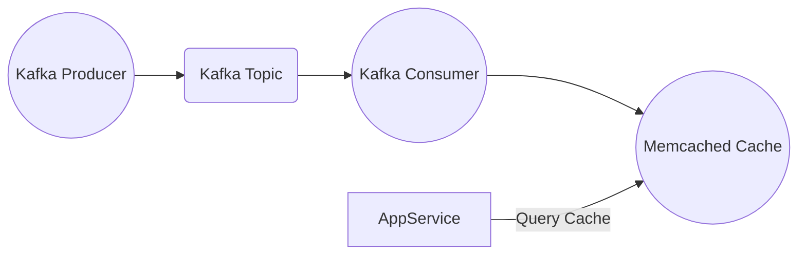

In the modern data-driven landscape, managing **real-time data streams** efficiently is critical for applications ranging from financial trading to IoT telemetry. Apache Kafka has emerged as a leading distributed streaming platform capable of handling massive volumes of data with high throughput and fault tolerance. However, *accessing* this data with minimal latency remains a challenge, especially for applications requiring immediate responses.

This is where **Memcached**, a high-performance, distributed memory caching system, plays a pivotal role. By caching Kafka data streams, Memcached can significantly reduce the read latency and improve overall system responsiveness. In this post, we’ll delve into the technical nuances of using Memcached as a cache layer for Kafka real-time streams, targeting intermediate and advanced developers aiming to optimize their streaming architectures.

#### Why Use Memcached with Apache Kafka?

Apache Kafka excels at providing durable, scalable, and fault-tolerant data streams, but it is primarily designed for batch or streaming consumption rather than ultra-low-latency retrieval. When your application demands **near-instantaneous access** to the latest streaming data, querying Kafka directly can introduce latency due to disk I/O, network overhead, and consumer group management.

Memcached complements Kafka by:

- **Reducing Latency**: Serving frequently accessed data from memory instead of disk or network.
- **Offloading Kafka Consumers**: Preventing redundant reads and decreasing consumer load.
- **Scalability**: Providing a horizontally scalable cache layer that can grow with your user base.
- **Simplifying Access**: Offering simple key-value retrieval APIs that fit many real-time use cases.

#### Architectural Overview of Kafka and Memcached Integration

A common architectural pattern involves Kafka as the **source of truth** and Memcached as a **fast-access cache** for hot data. The workflow typically follows these steps:

1. **Kafka Producers** publish data to topics representing real-time event streams.
2. **Kafka Consumers** read from these topics and update Memcached entries with the latest or aggregated data.
3. Application services query Memcached for the current state or recent data snapshots instead of querying Kafka directly.

This decouples the data ingestion pipeline from the data serving layer, enabling **high-concurrency reads** with minimal latency.



#### Implementing Memcached as a Cache for Kafka Streams

To implement this caching strategy effectively, consider the following technical steps:

- **Kafka Consumer Setup**: Use Kafka clients (e.g., Java KafkaConsumer) to consume streaming events continuously or with micro-batch semantics.
- **Data Processing and Transformation**: Optionally process or aggregate data to reduce cache size and improve hit rate.
- **Memcached Client Integration**: Use a robust Memcached client library (such as `spymemcached` for Java or `pylibmc` for Python) to write data into the cache.
- **Key Design Strategy**: Use meaningful keys that represent the latest state per entity or event type (e.g., `user:1234:latest_event`).
- **TTL Management**: Set appropriate expiration times to keep cache data fresh and avoid stale reads.
- **Error Handling & Resilience**: Implement retry mechanisms and fallback logic in case Memcached is unavailable.

```java
// Example Java snippet: Consuming Kafka records and updating Memcached cache
KafkaConsumer<String, String> consumer = new KafkaConsumer<>(props);
consumer.subscribe(Collections.singletonList("events"));

MemcachedClient memcachedClient = new MemcachedClient(new InetSocketAddress("localhost", 11211));

while (true) {
    ConsumerRecords<String, String> records = consumer.poll(Duration.ofMillis(100));
    for (ConsumerRecord<String, String> record : records) {
        String cacheKey = "event:" + record.key() + ":latest";
        memcachedClient.set(cacheKey, 300, record.value());
    }
}
```

#### Best Practices for Optimizing Cache Performance

1. **Batch Writes to Memcached**: Minimize network overhead by batching cache updates where possible.
2. **Cache Aside Pattern**: Implement cache aside logic on the application side to fetch from cache first and fallback to Kafka if needed.
3. **Monitor Cache Hit Ratios**: Use metrics to track cache efficiency and tune TTLs or key strategies accordingly.
4. **Data Serialization**: Use lightweight serialization formats (e.g., JSON, MessagePack) to speed up cache operations.
5. **Scaling Memcached Cluster**: Distribute cache nodes using consistent hashing to avoid hotspots and ensure high availability.

#### Use Cases and Performance Implications

- **Real-Time Analytics Dashboards**: Dashboards querying the latest event metrics benefit from Memcached’s fast retrieval.
- **User Session Management**: Kafka streams user activity, while Memcached caches session states for instant validation.
- **IoT Telemetry Monitoring**: High-frequency sensor data ingested via Kafka can be cached for immediate anomaly detection.

Benchmark studies indicate that Memcached access times typically remain under 1 millisecond, vastly outperforming direct Kafka queries which can range upwards of tens to hundreds of milliseconds depending on cluster load and network conditions.

#### Conclusion

Integrating Memcached with Apache Kafka offers a powerful approach to **reducing latency** and **scaling real-time data access** for high-throughput systems. By caching the most recent Kafka stream data in Memcached, developers can unlock near-instantaneous responses critical for real-time applications.

For intermediate and advanced users, mastering this caching strategy involves careful consideration of key design, cache invalidation, and consumer processing patterns. When executed correctly, this combination not only enhances system performance but also optimizes resource utilization, paving the way for robust, responsive real-time data architectures.
